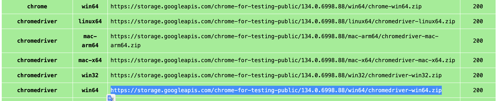

# AgenticSeek: Private, Local Manus Alternative.

<p align="center">

<p>

[English](./README.md) | 中文 | [日本語](./README_JP.md)

*一个 **100% 本地替代 Manus AI** 的方案，这款支持语音的 AI 助理能够自主浏览网页、编写代码和规划任务，同时将所有数据保留在您的设备上。专为本地推理模型量身打造，完全在您自己的硬件上运行，确保完全的隐私保护和零云端依赖。*

[](https://fosowl.github.io/agenticSeek.html)  [](https://discord.gg/8hGDaME3TC) [](https://x.com/Martin993886460)

### 为什么选择 AgenticSeek？

* 🔒 完全本地化与隐私保护 - 所有功能都在您的设备上运行 — 无云端服务，无数据共享。您的文件、对话和搜索始终保持私密。

* 🌐 智能网页浏览 - AgenticSeek 能够自主浏览互联网 — 搜索、阅读、提取信息、填写网页表单 — 全程无需人工操作。

* 💻 自主编码助手 - 需要代码？它可以编写、调试并运行 Python、C、Go、Java 等多种语言的程序 — 全程无需监督。

* 🧠 智能代理选择 - 您提问，它会自动选择最适合该任务的代理。就像拥有一个随时待命的专家团队。

* 📋 规划与执行复杂任务 - 从旅行规划到复杂项目 — 它能将大型任务分解为步骤，并利用多个 AI 代理完成工作。

* 🎙️ 语音功能 - 清晰、快速、未来感十足的语音与语音转文本功能，让您能像科幻电影中一样与您的个人 AI 助手对话。

https://github.com/user-attachments/assets/4bd5faf6-459f-4f94-bd1d-238c4b331469

> 🛠️ **目前还在开发阶段** – 欢迎任何贡献者加入我们！

---

## **安装**

确保已安装了 Chrome driver，Docker 和 Python 3.10（或更新）。

我们强烈建议您使用 Python 3.10 进行设置，否则可能会发生依赖错误。

有关于 Chrome driver 的问题，请参见 **Chromedriver** 部分。

### 1️⃣ **复制储存库与设置环境变数**

```sh
git clone https://github.com/Fosowl/agenticSeek.git
cd agenticSeek
mv .env.example .env
```

### 2️ **建立虚拟环境**

```sh
python3 -m venv agentic_seek_env
source agentic_seek_env/bin/activate
# On Windows: agentic_seek_env\Scripts\activate
```

### 3️⃣ **安装所需套件**

**自动安装:**

```sh
./install.sh
```

** 若要让文本转语音（TTS）功能支持中文，你需要安装 jieba（中文分词库）和 cn2an（中文数字转换库）：**

```
pip3 install jieba cn2an
```

**手动安装:**


**注意：对于任何操作系统，请确保您安装的 ChromeDriver 与您已安装的 Chrome 版本匹配。运行 `google-chrome --version`。如果您的 Chrome 版本 > 135，请参阅已知问题**

- *Linux*:

更新软件包列表：`sudo apt update`

安装依赖项：`sudo apt install -y alsa-utils portaudio19-dev python3-pyaudio libgtk-3-dev libnotify-dev libgconf-2-4 libnss3 libxss1`

安装与您的 Chrome 浏览器版本匹配的 ChromeDriver：
`sudo apt install -y chromium-chromedriver`

安装 requirements：`pip3 install -r requirements.txt`

- *Macos*:

更新 brew：`brew update`

安装 chromedriver：`brew install --cask chromedriver`

安装 portaudio：`brew install portaudio`

升级 pip：`python3 -m pip install --upgrade pip`

升级 wheel：`pip3 install --upgrade setuptools wheel`

安装 requirements：`pip3 install -r requirements.txt`

- *Windows*:

安装 pyreadline3：`pip install pyreadline3`

手动安装 portaudio（例如，通过 vcpkg 或预编译的二进制文件），然后运行：`pip install pyaudio`

从以下网址手动下载并安装 chromedriver：https://sites.google.com/chromium.org/driver/getting-started

将 chromedriver 放置在包含在您的 PATH 中的目录中。

安装 requirements：`pip3 install -r requirements.txt`


## 在本地机器上运行 AgenticSeek

**建议至少使用 Deepseek 14B 以上参数的模型，较小的模型难以使用助理功能并且很快就会忘记上下文之间的关系。**

**本地运行助手**

启动你的本地提供者，例如使用 ollama：

```sh
ollama serve
```

请参阅下方支持的本地提供者列表。

**更新 config.ini**

修改 config.ini 文件以设置 provider_name 为支持的提供者，并将 provider_model 设置为该提供者支持的 LLM。我们推荐使用具有推理能力的模型，如 *Qwen* 或 *Deepseek*。

请参见 README 末尾的 **FAQ** 部分了解所需硬件。

```sh
[MAIN]
is_local = True # 无论是在本地运行还是使用远程提供者。
provider_name = ollama # 或 lm-studio, openai 等..
provider_model = deepseek-r1:14b # 选择适合您硬件的模型
provider_server_address = 127.0.0.1:11434
agent_name = Jarvis # 您的 AI 助手的名称
recover_last_session = True # 是否恢复之前的会话
save_session = True # 是否记住当前会话
speak = True # 文本转语音
listen = False # 语音转文本，仅适用于命令行界面
work_dir = /Users/mlg/Documents/workspace # AgenticSeek 的工作空间。
jarvis_personality = False # 是否使用更"贾维斯"风格的性格，不推荐在小型模型上使用
languages = en zh # 语言列表，文本转语音将默认使用列表中的第一种语言
[BROWSER]
headless_browser = True # 是否使用无头浏览器，只有在使用网页界面时才推荐使用。
stealth_mode = True # 使用无法检测的 selenium 来减少浏览器检测
```

警告：使用 LM-studio 运行 LLM 时，请*不要*将 provider_name 设置为 `openai`。请将其设置为 `lm-studio`。

注意：某些提供者（如 lm-studio）需要在 IP 前面加上 `http://`。例如 `http://127.0.0.1:1234`


**本地提供者列表**

| 提供者 | 本地? | 描述 |
|-------------|--------|-------------------------------------------------------|
| ollama | 是 | 使用 ollama 作为 LLM 提供者，轻松本地运行 LLM |
| lm-studio | 是 | 使用 LM Studio 本地运行 LLM（将 `provider_name` 设置为 `lm-studio`）|
| openai | 否 | 使用兼容的 API |

下一步： [Start services and run AgenticSeek](#Start-services-and-Run)

---

## **Run with an API （透过 API 执行）**

设定 `config.ini`。

```sh
[MAIN]
is_local = False
provider_name = openai
provider_model = gpt-4o
provider_server_address = 127.0.0.1:5000
```

警告：确保 `config.ini` 没有行尾空格。

如果使用基于本机的 openai-based api 则把 `is_local` 设定为 `True`。

同时更改你的 IP 为 openai-based api 的 IP。

下一步： [Start services and run AgenticSeek](#Start-services-and-Run)

---

## Start services and Run
(启动服务并运行)

如果需要，请激活你的 Python 环境。
```sh
source agentic_seek_env/bin/activate
```

启动所需的服务。这将启动 `docker-compose.yml` 中的所有服务，包括：
- searxng
- redis（由 redis 提供支持）
- 前端

```sh
sudo ./start_services.sh # MacOS
start ./start_services.cmd # Windows
```

**选项 1:** 使用 CLI 界面运行。

```sh
python3 cli.py
```

**选项 2:** 使用 Web 界面运行。

注意：目前我們建議您使用 CLI 界面。Web 界面仍在積極開發中。

启动后端服务。

```sh
python3 api.py
```

访问 `http://localhost:3000/`，你应该会看到 Web 界面。

请注意，目前 Web 界面不支持消息流式传输。


*如果你不知道如何开始，请参阅 **Usage** 部分*

---

## Usage （使用方法）

为确保 agenticSeek 在中文环境下正常工作，请确保在 config.ini 中设置语言选项。
languages = en zh
更多信息请参阅 Config 部分

确定所有的核心档案都启用了，也就是执行过这条命令 `./start_services.sh` 然后你就可以使用 `python3 cli.py` 来启动 AgenticSeek 了！

```sh
sudo ./start_services.sh
python3 cli.py
```

当你看到执行后显示 `>>> `
这表示一切运作正常，AgenticSeek 正在等待你给他任何指令。
你也可以透过设定 `config.ini` 内的 `listen = True` 来启用语音转文字。

要退出时，只要和他说 `goodbye` 就可以退出！

以下是一些用法：

### Coding/Bash

> *在 Golang 中帮助我进行矩阵乘法*

> *使用 nmap 扫描我的网路，找出是否有任何可疑装置连接*

> *用 Python 制作一个贪食蛇游戏*

### 网路搜寻

> *进行网路搜寻，找出日本从事尖端人工智慧研究的酷炫科技新创公司*

> *你能在网路上找到谁创造了 AgenticSeek 吗？*

> *你能在哪个网站上找到便宜的 RTX 4090 吗？*

### 档案浏览与搜寻

> *嘿，你能找到我遗失的 million_dollars_contract.pdf 在哪里吗？*

> *告诉我我的磁碟还剩下多少空间*

> *寻找并阅读 README.md，并按照安装说明进行操作*

### 日常聊天

> *告诉我关于法国的事*

> *人生的意义是什么？*

> *我应该在锻炼前还是锻炼后服用肌酸？*


当你把指令送出后，AgenticSeek 会自动调用最能提供帮助的助理，去完成你交办的工作和指令。

但也有可能出现怪怪的情况，或是你要找飞机机票，他跑去教你如何一步步做出一台飞机（开玩笑的，但真的可能出现），因为这是一个早期专案，我们会努力教导他、完善他的！

所以我们希望你在使用时，能明确地表明你希望他要怎么做，下面给你一个范例！

你该说：
- 进行网络搜索，找出哪些国家最适合独自旅行


而不是说：
- 你知道哪些国家适合独自旅行？

---


---

## **在本地执行属于你的 LLM 伺服器**

如果你有一台功能强大的电脑或伺服器，但你想透过笔记型电脑使用它，那么你可以选择在远端伺服器上执行 LLM。

### 1️⃣ **设定并启动伺服器脚本**

在运行 AI 模型的「伺服器」上，取得 IP 位址

```sh
ip a | grep "inet " | grep -v 127.0.0.1 | awk '{print $2}' | cut -d/ -f1
```

注意：请在 Windows 或 MacOS，分别使用 `ipconfig` 与 `ifconfig` 来寻找 IP 位址。

**如果你希望使用基于 Openai 的服务，请按照 *透过 API 执行* 部分进行。**

复制储存库并且进入 `server/` 资料夹。

```sh
git clone --depth 1 https://github.com/Fosowl/agenticSeek.git
cd agenticSeek/server/
```

安装伺服器所需的套件：

```sh
pip3 install -r requirements.txt
```

执行伺服器脚本。

```sh
python3 app.py --provider ollama --port 3333
```

您可以选择使用 `ollama` 或 `llamacpp` 作为 LLM 的服务框架。

### 2️⃣ **执行**

在你的电脑上：

- 更改 `config.ini`
- `provider_name = server`
- `provider_model = deepseek-r1:14b`
- `provider_server_address = {你执行模型的电脑的 IP 位址}`

```sh
[MAIN]
is_local = False
provider_name = server
provider_model = deepseek-r1:14b
provider_server_address = x.x.x.x:3333
```


---

## 语音转文字

请注意，目前语音转文字功能仅支持英语。

预设状况下，语音转文字功能是停用的。若要启用它，请在 `config.ini` 档案中，将 `listen` 选项设为 `True`：

```
listen = True
```

启用后 AgenticSeek 会聆听你是否呼唤他，他才会开始听你说的话，你可以在 *config.ini* 内去设定，要怎么叫他。

```
agent_name = Friday
```

为了获得比较好的结果，我们建议使用常见的英文名称（如 “John” 或 “Emma”）作为他的名字。

当你看到程式开始执行时，请大声说出他的名字，就可以唤醒 AgenticSeek 去聆听！（如：Friday）

清楚说出你的需求。

用确认短句结束你说的话，以通知 AgenticSeek 继续。确认短句的范例包括：
```
"do it", "go ahead", "execute", "run", "start", "thanks", "would ya", "please", "okay?", "proceed", "continue", "go on", "do that", "go it", "do you understand?"
```

## Config

Config 范例：
```
[MAIN]
is_local = True
provider_name = ollama
provider_model = deepseek-r1:1.5b
provider_server_address = 127.0.0.1:11434
agent_name = Friday
recover_last_session = False
save_session = False
speak = False
listen = False
work_dir = /Users/mlg/Documents/ai_folder
jarvis_personality = False
languages = en zh
[BROWSER]
headless_browser = False
stealth_mode = False
```

**说明**:
- is_local
- True：在本地运行。
- False：在远端伺服器运行。
- provider_name
- 框架类型
- `ollama`, `server`, `lm-studio`, `deepseek-api`
- provider_model
- 运行的模型
- `deepseek-r1:1.5b`, `deepseek-r1:14b`
- provider_server_address
- 伺服器 IP
- `127.0.0.1:11434`
- agent_name
- AgenticSeek 的名字，用作TTS的触发单词。
- `Friday`
- recover_last_session
- True：从上个对话继续。
- False：重启对话。
- save_session
- True：储存对话纪录。
- False：不保存。
- speak
- True：启用语音输出。
- False：关闭语音输出。
- listen
- True：启用语音输入。
- False：关闭语音输入。
- work_dir
- AgenticSeek 拥有能存取与交互的工作目录。
- jarvis_personality
> 就是那个钢铁人的 JARVIS
- True：启用 JARVIS 个性。
- False：关闭 JARVIS 个性。
- headless_browser
- True：前景浏览器。（很酷，推荐使用他 XD）
- False：背景执行浏览器。
- stealth_mode
- 隐私模式，但需要你自己安装反爬虫扩充功能。
- languages
- 支持的语言列表。用于代理路由系统。语言列表越长，下载的模型越多。

## 框架

下表显示了可用的框架：

| 框架 | 本地? | 描述|
|-|-|-|
| ollama | 可 | 使用 ollama 框架去执行本地模型 |
| server | 可 | 本地伺服器执行模型远端调用 |
| lm-studio | 可 | 使用 LM Studio 在本地运行 LLM（设定provider_name为lm-studio）|
| openai | 不可 | 使用 ChatGPT API（无法保证隐私）|
| deepseek-api | 不可 | 使用 Deepseek API (无法保证隐私)|
| huggingface | 不可 | 使用 Hugging-Face API (无法保证隐私)|

若要选择框架，请变更 `config.ini` 文件：

```
is_local = False
provider_name = openai
provider_model = gpt-4o
provider_server_address = 127.0.0.1:5000
```
`is_local`: 对于任何本地运行的 LLM 都应该为 True，否则为 False。

`provider_name`: 透过名称选择要使用的框架，请参阅上面的框架清单。

`provider_model`: 设定 AgenticSeek 使用的模型。

`provider_server_address`: 如果不使用云端 API，则可以将其设定为任何内容。

# Known issues （已知问题）

## Chromedriver Issues

**已知问题 #1:** *chromedriver mismatch*

`Exception: Failed to initialize browser: Message: session not created: This version of ChromeDriver only supports Chrome version 113
Current browser version is 134.0.6998.89 with binary path`

如果你的浏览器和 chromedriver 版本不一样，就会发生这种情况。

你可以透过以下连结下载最新版本：

https://developer.chrome.com/docs/chromedriver/downloads

如果您使用的是 Chrome 版本 115 或更新版本，请前往：

https://googlechromelabs.github.io/chrome-for-testing/

下载与你的作业系统相符的 chromedriver 版本。



如果有其他问题，请提供尽量详细的叙述到 Issues 上，尽可能包含当前环境和问题是怎么发生的。

## FAQ

**Q: 我需要什麼硬體？**  

| 模型大小  | GPU  | 備註                                               |
|-----------|--------|-----------------------------------------------------------|
| 7B        | 8GB Vram | ⚠️ 不推薦。性能較差，經常出現幻覺，規劃代理可能會失敗。 |
| 14B        | 12 GB VRAM (例如 RTX 3060) | ✅ 適用於簡單任務。可能在網頁瀏覽和規劃任務上表現不佳。 |
| 32B        | 24+ GB VRAM (例如 RTX 4090) | 🚀 大多數任務成功，但可能仍在任務規劃上有困難。 |
| 70B+        | 48+ GB Vram (例如 mac studio) | 💪 表現優異。建議用於高級使用情境。 |

**Q：为什么选择 Deepseek R1 而不是其他模型？**

就其尺寸而言，Deepseek R1 在推理和使用方面表现出色。我们认为非常适合我们的需求，其他模型也很好用，但 Deepseek 是我们最后选定的模型。

**Q：我在执行时 `cli.py` 时出现错误。我该怎么办？**

1. 确保 Ollama 正在运行（ollama serve）
2. 你 `config.ini` 内 `provider_name` 的框架选择正确。
3. 依赖套件已安装
4. 如果均无效，请随时提出 Issues，同样尽可能包含当前环境和问题是怎么发生的。

**Q：它真的是 100% 本地运行吗？**

是的，透过 Ollama 或其他框架，所有语音转文字、LLM 和文字转语音模型都在本地运行。
*但你能选择非本地执行（OpenAI 或其他 API），同样也是可以的*


**Q：我有 Manus 为甚么还要用 AgenticSeek？**

这是我们因为兴趣做的一个小 Side-Project，他特别的点在于是一个全部本地化的模型，而且可以像钢铁人里面一样与 `Jarvis` 对话，听起来就超级酷的吧！随着 Manus 的进化，我们也相应的加入更多功能！

**Q：它比 Manus 好在哪里？**

不不不，AgenticSeek 和 Manus 是不同取向的东西，我们优先考虑的是本地执行和隐私，而不是基于云端。这是一个与 Manus 相比起来更有趣且易使用的方案！

**Q: 是否支持中文以外的语言？**

DeepSeek R1 天生会说中文

但注意：代理路由系统只懂英文，所以必须通过 config.ini 的 languages 参数（如 languages = en zh）告诉系统：

如果不设置中文？后果可能是：你让它写代码，结果跳出来个"医生代理"（虽然我们根本没有这个代理... 但系统会一脸懵圈！）

实际上会下载一个小型翻译模型来协助任务分配

## 贡献

我们正在寻找开发者来改善 AgenticSeek！你可以在 Issues 查看未解决的问题或和我们讨论更酷的新功能！

[](https://www.star-history.com/#Fosowl/agenticSeek&Date)

[Contribution guide](./docs/CONTRIBUTING.md)

## 维护者:

 > [Fosowl](https://github.com/Fosowl) | 巴黎时间 | （有时很忙）

 > [https://github.com/antoineVIVIES](https://github.com/antoineVIVIES) | 台北时间 | （经常很忙）

 > [steveh8758](https://github.com/steveh8758) | 台北时间 | （总是很忙）
