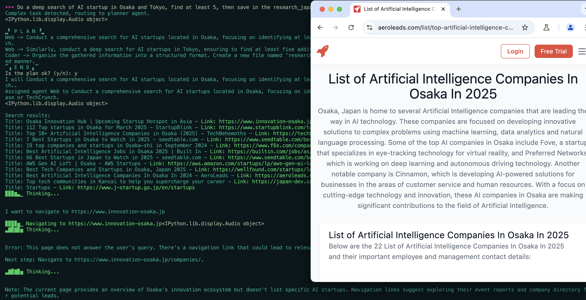

<p align="center">

<p>

--------------------------------------------------------------------------------
[English](./README.md) | 繁體中文

# AgenticSeek: 類似 Manus 但基於 Deepseek R1 Agents 的本地模型。


**Manus AI 的本地替代品**，它是一個具有語音功能的大語言模型秘書，可以 Coding、訪問你的電腦文件、瀏覽網頁，並自動修正錯誤與反省，最重要的是不會向雲端傳送任何資料。採用 DeepSeek R1 等推理模型構建，完全在本地硬體上運行，進而保證資料的隱私。

[](https://fosowl.github.io/agenticSeek.html)  [](https://discord.gg/4Ub2D6Fj)

> 🛠️ **目前還在開發階段** – 歡迎任何貢獻者加入我們！


> *Do a deep search of AI startup in Osaka and Tokyo, find at least 5, then save in the research_japan.txt file*

> *Can you make a tetris game in C ?*

> *I would like to setup a new project file index as mark2.*


### AgenticSeek 可以進行任務規劃！



## Features:

- **100% 本機運行**: 本機運行，不使用雲端服務，所以資料絕不會散布出去，我的東西還是我的！不會被當作其他服務的訓練資料。

- **文件的交互系統**: 使用 bash 去瀏覽本機資料和操作本機系統。

- **自主 Coding**: AgenticSeek 可以自己運行、Debug、編譯 Python、C、Golang 和各種語言。

- **代理助理**: 不同的工作由不同的助理去處理問題。AgenticSeek 會自己尋找最適合的助理去做相對應的工作。

- **規劃**: 對於複雜的任務，AgenticSeek 會交辦給不同的助理進行規劃和執行。

- **自主學習**: 自動在網路上尋找資料。

- **記憶功能**: 對於每次的對話進行統整、保存對話，並且在本地儲存用戶的使用習慣。

---

## **安裝**

確保已安裝了 Chrome driver，Docker 和 Python 3.10（或更新）。

有關於 Chrome driver 的問題，請參見 **Chromedriver** 部分。

### 1️⃣ **複製儲存庫與設置環境變數**

```sh
git clone https://github.com/Fosowl/agenticSeek.git
cd agenticSeek
mv .env.example .env
```

### 2️ **建立虛擬環境**

```sh
python3 -m venv agentic_seek_env
source agentic_seek_env/bin/activate     
# On Windows: agentic_seek_env\Scripts\activate
```

### 3️⃣ **安裝所需套件**

**自動安裝:**

```sh
./install.sh
```

**手動安裝:**

```sh
pip3 install -r requirements.txt
# or
python3 setup.py install
```


## 在本地機器上運行 AgenticSeek

**建議至少使用 Deepseek 14B 以上參數的模型，較小的模型難以使用助理功能並且很快就會忘記上下文之間的關係。**

### 1️⃣ **下載模型**  

確定已經安裝 [Ollama](https://ollama.com/)。

請在 [DeepSeek](https://deepseek.com/models) 下載至少大於 `deepseek-r1:14b` 的模型。

```sh
ollama pull deepseek-r1:14b
```

### 2️ **啟動框架 （ollama）**

啟動 Ollama 服務器。
```sh
ollama serve
```

請更改 `config.ini` 文件，將 `provider_name` 設置為 `ollama` 並且 `provider_model` 設置為你剛剛下載的模型，如 `deepseek-r1:14b`。

注意：`deepseek-r1:14b` 只是範例，如果你的電腦允許的話，請使用更大的模型。

```sh
[MAIN]
is_local = True
provider_name = ollama
provider_model = deepseek-r1:14b
provider_server_address = 127.0.0.1:11434
```

開始所有服務:

```sh
sudo ./start_services.sh # MacOS
start ./start_services.cmd # Window
```


運行 AgenticSeek:

```sh
python3 main.py
```

*如果你不知道如何開始，請參閱 **Usage** 部分*

*如果遇到問題，請先參考 **Known issues** 部分*


*如果你的電腦無法在本機運行 deepseek，也許你可以試看看 API 的方式，參見 **Run with an API***

*有關設定檔的詳細解釋，請參閱 **Config** 部分。*

---

## Usage （使用方法）

確定所有的核心檔案都啟用了，也就是執行過這條命令 `./start_services.sh` 然後你就可以使用 `python3 main.py` 來啟動 AgenticSeek 了！

```sh
sudo ./start_services.sh
python3 main.py
```

當你看到執行後顯示 `>>> `
這表示一切運作正常，AgenticSeek 正在等待你給他任何指令。
你也可以透過設定 `config.ini` 內的 `listen = True` 來啟用語音轉文字。

要退出時，只要和他說 `goodbye` 就可以退出！

以下是一些用法：

### Coding/Bash

> *Help me with matrix multiplication in Golang*

> *Scan my network with nmap, find if any suspicious devices is connected*

> *Make a snake game in python*

### 網路搜尋

> *Do a web search to find cool tech startup in Japan working on cutting edge AI research*

> *Can you find on the internet who created agenticSeek?*

> *Can you find on which website I can buy a rtx 4090 for cheap*

### 檔案瀏覽與搜尋

> *Hey can you find where is million_dollars_contract.pdf i lost it*

> *Show me how much space I have left on my disk*

> *Find and read the README.md and follow the install instruction*

### 日常聊天

> *Tell me about France*

> *What is the meaning of life ?*

> *Should I take creatine before or after workout?*


當你把指令送出後，AgenticSeek 會自動調用最能提供幫助的助理，去完成你交辦的工作和指令。

但也有可能出現怪怪的情況，或是你要找飛機機票，他跑去教你如何一步步做出一台飛機（開玩笑的，但真的可能出現），因為這是一個早期專案，我們會努力教導他、完善他的！

所以我們希望你在使用時，能明確地表明你希望他要怎麼做，下面給你一個範例！

你該說：
`Do a web search and find out which are the best country for solo-travel`


而不是說：
`Do you know some good countries for solo-travel?`

---

## **在本地執行屬於你的 LLM 伺服器** 

如果你有一台功能強大的電腦或伺服器，但你想透過筆記型電腦使用它，那麼你可以選擇在遠端伺服器上執行 LLM。

### 1️⃣  **設定並啟動伺服器腳本** 

在運行 AI 模型的「伺服器」上，取得 IP 位址

```sh
ip a | grep "inet " | grep -v 127.0.0.1 | awk '{print $2}' | cut -d/ -f1
```

注意：請在 Windows 或 MacOS，分別使用 `ipconfig` 與 `ifconfig` 來尋找 IP 位址。

**如果你希望使用基於 Openai 的服務，請按照 *透過 API 執行* 部分進行。**

複製儲存庫並且進入 `server/` 資料夾。

```sh
git clone --depth 1 https://github.com/Fosowl/agenticSeek.git
cd agenticSeek/server/
```

安裝伺服器所需的套件：

```sh
pip3 install -r requirements.txt
```

執行伺服器腳本。

```sh
python3 app.py --provider ollama --port 3333
```

您可以選擇使用 `ollama` 或 `llamacpp` 作為 LLM 的服務框架。

### 2️⃣ **執行** 

在你的電腦上：

- 更改 `config.ini`
    - `provider_name = server`
    - `provider_model = deepseek-r1:14b`
    - `provider_server_address = {你執行模型的電腦的 IP 位址}`

```sh
[MAIN]
is_local = False
provider_name = server
provider_model = deepseek-r1:14b
provider_server_address = x.x.x.x:3333
```

執行 AgenticSeek：

```sh
sudo ./start_services.sh
python3 main.py
```

## **Run with an API （透過 API 執行）**

設定 `config.ini`。

```sh
[MAIN]
is_local = False
provider_name = openai
provider_model = gpt-4o
provider_server_address = 127.0.0.1:5000
```

警告：確保 `config.ini` 沒有行尾空格。

如果使用基於本機的 openai-based api 則把 `is_local` 設定為 `True`。

同時更改你的 IP 為 openai-based api 的 IP。

執行 AgenticSeek：

```sh
sudo ./start_services.sh
python3 main.py
```

---

## 語音轉文字

預設狀況下，語音轉文字功能是停用的。若要啟用它，請在 `config.ini` 檔案中，將 `listen` 選項設為 `True`：

```
listen = True
```

啟用後 AgenticSeek 會聆聽你是否呼喚他，他才會開始聽你說的話，你可以在 *config.ini* 內去設定，要怎麼叫他。

```
agent_name = Friday
```

為了獲得比較好的結果，我們建議使用常見的英文名稱（如 “John” 或 “Emma”）作為他的名字。

當你看到程式開始執行時，請大聲說出他的名字，就可以喚醒 AgenticSeek 去聆聽！（如：Friday）

清楚說出你的需求。

用確認短句結束你說的話，以通知 AgenticSeek 繼續。確認短句的範例包括：
```
"do it", "go ahead", "execute", "run", "start", "thanks", "would ya", "please", "okay?", "proceed", "continue", "go on", "do that", "go it", "do you understand?"
```

## Config

Config 範例：
```
[MAIN]
is_local = True
provider_name = ollama
provider_model = deepseek-r1:1.5b
provider_server_address = 127.0.0.1:11434
agent_name = Friday
recover_last_session = False
save_session = False
speak = False
listen = False
work_dir =  /Users/mlg/Documents/ai_folder
jarvis_personality = False
[BROWSER]
headless_browser = False
stealth_mode = False
```

**說明**:
- is_local
    - True：在本地運行。
    - False：在遠端伺服器運行。
- provider_name
    - 框架類型
        - `ollama`, `server`, `lm-studio`, `deepseek-api`
- provider_model
    - 運行的模型
        - `deepseek-r1:1.5b`, `deepseek-r1:14b`
- provider_server_address
    - 伺服器 IP
        - `127.0.0.1:11434`
- agent_name
    - AgenticSeek 的名字，用作TTS的觸發單詞。
        - `Friday`
- recover_last_session
    - True：從上個對話繼續。
    - False：重啟對話。
- save_session
    - True：儲存對話紀錄。
    - False：不保存。
- speak
    - True：啟用語音輸出。
    - False：關閉語音輸出。
- listen
    - True：啟用語音輸入。
    - False：關閉語音輸入。
- work_dir
    - AgenticSeek 擁有能存取與交互的工作目錄。
- jarvis_personality
    > 就是那個鋼鐵人的 JARVIS 
    - True：啟用 JARVIS 個性。
    - False：關閉 JARVIS 個性。
- headless_browser
    - True：前景瀏覽器。（很酷，推薦使用他 XD）
    - False：背景執行瀏覽器。
- stealth_mode
    -  隱私模式，但需要你自己安裝反爬蟲擴充功能。

## 框架

下表顯示了可用的框架：

| 框架  | 本地? | 描述|
|-|-|-|
| ollama | 可 | 使用 ollama 框架去執行本地模型 |
| server | 可 | 本地伺服器執行模型遠端調用 |
| lm-studio | 可 | 使用 LM Studio 在本地運行 LLM（設定provider_name為lm-studio）|
| openai | 不可 | 使用 ChatGPT API（無法保證隱私）|
| deepseek-api | 不可 | 使用 Deepseek API (無法保證隱私)|
| huggingface | 不可 | 使用 Hugging-Face API (無法保證隱私)|

若要選擇框架，請變更 `config.ini` 文件：

```
is_local = False
provider_name = openai
provider_model = gpt-4o
provider_server_address = 127.0.0.1:5000
```
`is_local`: 對於任何本地運行的 LLM 都應該為 True，否則為 False。

`provider_name`: 透過名稱選擇要使用的框架，請參閱上面的框架清單。

`provider_model`: 設定 AgenticSeek 使用的模型。

`provider_server_address`: 如果不使用雲端 API，則可以將其設定為任何內容。

# Known issues （已知問題）

## Chromedriver Issues

**已知問題 #1:** *chromedriver mismatch*

`Exception: Failed to initialize browser: Message: session not created: This version of ChromeDriver only supports Chrome version 113
Current browser version is 134.0.6998.89 with binary path`

如果你的瀏覽器和 chromedriver 版本不一樣，就會發生這種情況。

你可以透過以下連結下載最新版本：

https://developer.chrome.com/docs/chromedriver/downloads

如果您使用的是 Chrome 版本 115 或更新版本，請前往：

https://googlechromelabs.github.io/chrome-for-testing/

下載與你的作業系統相符的 chromedriver 版本。


如果有其他問題，請提供盡量詳細的敘述到 Issues 上，盡可能包含當前環境和問題是怎麼發生的。

## FAQ

**Q：我需要什麼的硬體配備？**

7B 型號：具有 8GB VRAM 的 GPU。
14B 型號：12GB GPU（例如 RTX 3060）。
32B 型號：24GB+ VRAM。

**Q：為什麼選擇 Deepseek R1 而不是其他模型？**

就其尺寸而言，Deepseek R1 在推理和使用方面表現出色。我們認為非常適合我們的需求，其他模型也很好用，但 Deepseek 是我們最後選定的模型。

**Q：我在執行時 `main.py` 時出現錯誤。我該怎麼辦？**

1. 確保 Ollama 正在運行（ollama serve）
2. 你 `config.ini` 內 `provider_name` 的框架選擇正確。
3. 依賴套件已安裝
4. 如果均無效，請隨時提出 Issues，同樣盡可能包含當前環境和問題是怎麼發生的。

**Q：它真的是 100% 本地運行嗎？**

是的，透過 Ollama 或其他框架，所有語音轉文字、LLM 和文字轉語音模型都在本地運行。
*但你能選擇非本地執行（OpenAI 或其他 API），同樣也是可以的*


**Q：我有 Manus 為甚麼還要用 AgenticSeek？**

這是我們因為興趣做的一個小 Side-Project，他特別的點在於是一個全部本地化的模型，而且可以像鋼鐵人裡面一樣與 `Jarvis` 對話，聽起來就超級酷的吧！隨著 Manus 的進化，我們也相應的加入更多功能！

**Q：它比 Manus 好在哪裡？**

不不不，AgenticSeek 和 Manus 是不同取向的東西，我們優先考慮的是本地執行和隱私，而不是基於雲端。這是一個與 Manus 相比起來更有趣且易使用的方案！

## 貢獻

我們正在尋找開發者來改善 AgenticSeek！你可以在 Issues 查看未解決的問題或和我們討論更酷的新功能！

[](https://www.star-history.com/#Fosowl/agenticSeek&Date)

[Contribution guide](./docs/CONTRIBUTING.md)

## 作者:
 > [Fosowl](https://github.com/Fosowl)
 > [steveh8758](https://github.com/steveh8758) 