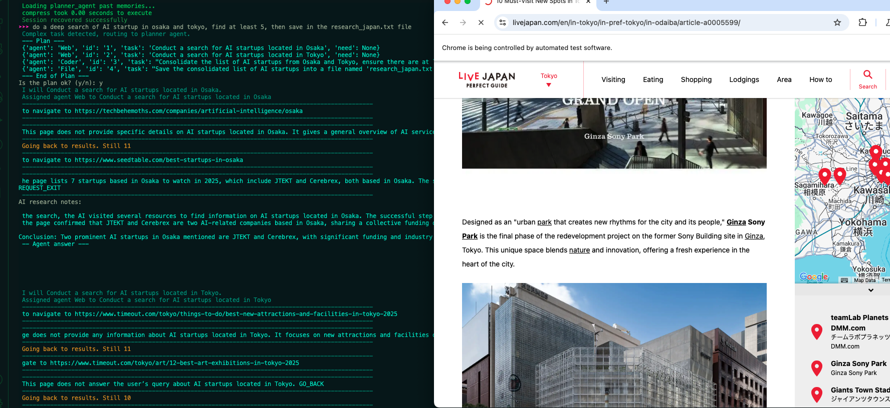

<p align="center">

<p>

--------------------------------------------------------------------------------
[English](./README.md) | [繁體中文](./README_CHT.md) | Français

# AgenticSeek: Une IA comme Manus mais à base d'agents DeepSeek R1 fonctionnant en local.

Une alternative **entièrement locale** à Manus AI, un assistant vocal IA qui code, explore votre système de fichiers, navigue sur le web et corrige ses erreurs, tout cela sans envoyer la moindre donnée dans le cloud. Construit avec des modèles de raisonnement comme DeepSeek R1, cet agent autonome fonctionne entièrement sur votre hardware, garantissant la confidentialité de vos données.

[](https://fosowl.github.io/agenticSeek.html)  [](https://discord.gg/4Ub2D6Fj)

> 🛠️ **En cours de développement** – On cherche activement des contributeurs!


> *Recherche sur le web des activités à faire à Paris*

> *Code le jeu snake en python*

> *J'aimerais que tu trouve une api météo et que tu me code un application qui affiche la météo à Toulouse*


### agenticSeek peut planifier des taches!



## Fonctionnalités:

- **100% Local**: Fonctionne en local sur votre PC. Vos données restent les vôtres. 

- **Accès à vos Fichiers**: Utilise bash pour naviguer et manipuler vos fichiers.

- **Codage semi-autonome**: Peut écrire, déboguer et exécuter du code en Python, C, Golang et d'autres langages à venir. 

- **Routage d'Agent**: Sélectionne automatiquement l’agent approprié pour la tâche. 

- **Planification**: Pour les taches complexe utilise plusieurs agents.

- **Navigation Web Autonome**: Navigation web autonome.

- **Memoire efficace**: Gestion efficace de la mémoire et des sessions. 

---

## **Installation**

Assurez-vous d’avoir installé le pilote Chrome, Docker et Python 3.10 (ou une version plus récente).

Pour les problèmes liés au pilote Chrome, consultez la section Chromedriver.

### 1️⃣ Cloner le dépôt et configurer

```sh
git clone https://github.com/Fosowl/agenticSeek.git
cd agenticSeek
mv .env.example .env
```

### 2 **Créer un environnement virtuel**

```sh
python3 -m venv agentic_seek_env
source agentic_seek_env/bin/activate     
# On Windows: agentic_seek_env\Scripts\activate
```

### 3️⃣ **Installation**

**Automatique:**

```sh
./install.sh
```

**Manuel:**

```sh
pip3 install -r requirements.txt
```


## Faire fonctionner sur votre machine 

**Nous recommandons d’utiliser au moins DeepSeek 14B, les modèles plus petits ont du mal avec l’utilisation des outils et oublient rapidement le contexte.**

### 1️⃣ **Téléchargement du modèle**  

Assurer vous d'avoir [Ollama](https://ollama.com/) installé.

Télécharger `deepseek-r1:14b` de [DeepSeek](https://deepseek.com/models)

```sh
ollama pull deepseek-r1:14b
```

### 2️ **Démarrage d'ollama**  

```sh
ollama serve
```

Modifiez le fichier config.ini pour définir provider_name sur ollama et provider_model sur deepseek-r1:14b

```sh
[MAIN]
is_local = True
provider_name = ollama
provider_model = deepseek-r1:14b
provider_server_address = 127.0.0.1:11434
```

démarrer tous les services :

```sh
sudo ./start_services.sh
```

Lancer l'assitant:

```sh
python3 main.py
```

Voir la section **Utilisation** si vous ne comprenez pas comment l’utiliser

Voir la section **Problèmes** connus si vous rencontrez des problèmes

Voir la section **Exécuter** avec une API si votre matériel ne peut pas exécuter DeepSeek localement

Voir la section **Configuration** pour une explication détaillée du fichier de configuration.

---

## Utilisation

Assurez-vous que les services sont en cours d’exécution avec ./start_services.sh et lancez AgenticSeek avec python3 main.py

```sh
sudo ./start_services.sh
python3 main.py
```

Vous verrez un prompt: ">>> "
Cela indique qu’AgenticSeek attend que vous saisissiez des instructions.
Vous pouvez également utiliser la reconnaissance vocale en définissant listen = True dans la configuration.

Pour quitter, dites simplement `goodbye`.

Voici quelques exemples d’utilisation :

### Programmation

> *Aide-moi avec la multiplication de matrices en Golang*

> *Initalize un nouveau project python, setup le readme, gitignore et tout le bordel et fait un premier commit*

> *Fais un jeu snake en Python*

### Recherche web

> *Fais une recherche sur le web pour trouver des startups technologiques au Japon qui travaillent sur des recherches avancées en IA*

> *Peux-tu trouver sur internet qui a créé agenticSeek ?*

> *Peux-tu trouver sur quel site je peux acheter une RTX 4090 à bas prix ?*

### Fichier

> *Hé, peux-tu trouver où est million_dollars_contract.pdf ? Je l’ai perdu*

> *Montre-moi combien d’espace il me reste sur mon disque*

> *Trouve et lis le fichier README.md et suis les instructions d’installation*

### Conversation

> *Parle-moi de la France*

> *Quel est le sens de la vie ?*

> *Donne moi une recette avec les ingrédients suivant de mon frigo...*

Après avoir saisi votre requête, AgenticSeek attribuera le meilleur agent pour la tâche.

Le système de routage des agents peut parfois ne pas toujours attribuer le bon agent en fonction de votre requête.

Par conséquent, vous devez être assez explicite sur ce que vous voulez et sur la manière dont l’IA doit procéder. Par exemple, si vous voulez qu’elle effectue une recherche sur le web, ne dites pas :

Connait-tu de bons pays pour voyager seul ?

Dites plutôt :

Fait une recherche sur le web, quels sont les meilleurs pays pour voyager seul?

---

## **Exécuter le LLM sur votre propre serveur**  

Si vous disposez d’un ordinateur puissant ou d’un serveur que vous voulez utiliser, mais que vous souhaitez y accéder depuis votre ordinateur portable, vous avez la possibilité d’exécuter le LLM sur un serveur distant.

### 1️⃣  **Configurer et démarrer les scripts du serveur** 

Sur votre "serveur" qui exécutera le modèle IA, obtenez l’adresse IP

```sh
ip a | grep "inet " | grep -v 127.0.0.1 | awk '{print $2}' | cut -d/ -f1
```

Remarque : Pour Windows ou macOS, utilisez respectivement ipconfig ou ifconfig pour trouver l’adresse IP.

**Si vous souhaitez utiliser un fournisseur basé sur OpenAI, suivez la section Exécuter avec une API.**

Clonez le dépôt et entrez dans le dossier server/.


```sh
git clone --depth 1 https://github.com/Fosowl/agenticSeek.git
cd agenticSeek/server/
```

Installez les dépendances spécifiques au serveur :

```sh
pip3 install -r requirements.txt
```

Exécutez le script du serveur.

```sh
python3 app.py --provider ollama --port 3333
```

Vous avez le choix entre utiliser ollama et llamacpp comme service LLM.

### 2️⃣ **Lancer** 

Maintenant, sur votre ordinateur personnel :

Modifiez le fichier config.ini pour définir provider_name sur server et provider_model sur deepseek-r1:14b.

Définissez provider_server_address sur l’adresse IP de la machine qui exécutera le modèle.

```sh
[MAIN]
is_local = False
provider_name = server
provider_model = deepseek-r1:14b
provider_server_address = x.x.x.x:3333
```

Exécutez l’assistant :

```sh
sudo ./start_services.sh
python3 main.py
```

## **Exécuter avec une API**  

AVERTISSEMENT : Assurez-vous qu’il n’y a pas d’espace en fin de ligne dans la configuration.

Définissez is_local sur True si vous utilisez une API basée sur OpenAI localement.

Changez l’adresse IP si votre API basée sur OpenAI fonctionne sur votre propre serveur.

```sh
[MAIN]
is_local = False
provider_name = openai
provider_model = gpt-4o
provider_server_address = 127.0.0.1:5000
```

Exécutez l’assistant :

```sh
sudo ./start_services.sh
python3 main.py
```

## Config

Exemple de configuration :
```
[MAIN]
is_local = True
provider_name = ollama
provider_model = deepseek-r1:1.5b
provider_server_address = 127.0.0.1:11434
agent_name = Friday
recover_last_session = False
save_session = False
speak = False
listen = False
work_dir =  /Users/mlg/Documents/ai_folder
jarvis_personality = False
[BROWSER]
headless_browser = False
stealth_mode = False
```

**Explanation**:

`is_local` -> Exécute l’agent localement (True) ou sur un serveur distant (False).

`provider_name` -> Le fournisseur à utiliser (parmi : ollama, server, lm-studio, deepseek-api).

`provider_model` -> Le modèle utilisé, par exemple, deepseek-r1:1.5b.

`provider_server_address` -> Adresse du serveur, par exemple, 127.0.0.1:11434 pour local. Définissez n’importe quoi pour une API non locale.

`agent_name` -> Nom de l’agent, par exemple, Friday. Utilisé comme mot déclencheur pour la reconnaissance vocale.

`recover_last_session` -> Reprend la dernière session (True) ou non (False).

`save_session` -> Sauvegarde les données de la session (True) ou non (False).

`speak` -> Active la sortie vocale (True) ou non (False).

`listen` -> Écoute les entrées vocales (True) ou non (False).

`work_dir` -> Dossier auquel l’IA aura accès, par exemple : /Users/user/Documents/.

`jarvis_personality` -> Utilise une personnalité de type JARVIS (True) ou non (False). Cela modifie simplement le fichier de prompt.

`headless_browser` -> Exécute le navigateur sans fenêtre visible (True) ou non (False).

`stealth_mode` -> Rend la détection des bots plus difficile. Le seul inconvénient est que vous devez installer manuellement l’extension anticaptcha.


## Providers

Le tableau ci-dessous montre les LLM providers disponibles :

| Provider  | Local? | Description                                               |
|-----------|--------|-----------------------------------------------------------|
| ollama    | Yes    | Exécutez des LLM localement avec facilité en utilisant Ollama comme fournisseur LLM 
| server    | Yes    | Hébergez le modèle sur une autre machine, exécutez sur votre machine locale 
| lm-studio  | Yes    | Exécutez un LLM localement avec LM Studio (définissez provider_name sur lm-studio) 
| openai    | No     | Utilise ChatGPT API (pas privé) |
| deepseek-api  | No     | Deepseek API (pas privé) |
| huggingface| No    | Hugging-Face API (pas privé) |

Pour sélectionner un provider LLM, modifiez le config.ini :

```
is_local = False
provider_name = openai
provider_model = gpt-4o
provider_server_address = 127.0.0.1:5000
```

`is_local` : doit être True pour tout LLM exécuté localement, sinon False.

`provider_name` : Sélectionnez le fournisseur à utiliser par son nom, voir la liste des fournisseurs ci-dessus.

`provider_model` : Définissez le modèle à utiliser par l’agent.

`provider_server_address` : peut être défini sur n’importe quoi si vous n’utilisez pas le fournisseur server.

# Problèmes connus 

## Problèmes avec Chromedriver

Erreur #1:**incompatibilité**

`Exception: Failed to initialize browser: Message: session not created: This version of ChromeDriver only supports Chrome version 113
Current browser version is 134.0.6998.89 with binary path`

Cela se produit s’il y a une incompatibilité entre votre navigateur et la version de chromedriver.

Vous devez naviguer pour télécharger la dernière version :

https://developer.chrome.com/docs/chromedriver/downloads

Si vous utilisez Chrome version 115 ou plus récent, allez sur :

https://googlechromelabs.github.io/chrome-for-testing/

Et téléchargez la version de chromedriver correspondant à votre système d’exploitation.


Si cette section est incomplète, merci de faire une nouvelle issue github.

## FAQ

**Q: J'ai besoin d'un gros PC?**  

ça dépend du modèle!
Pour un modèle 7B : GPU avec 8 Go de VRAM.
Pour un modèle 14B : GPU 12 Go (par exemple, RTX 3060).
Et un modèle 32B : 24 Go+ de VRAM.

**Q: Pourquoi deepseek et pas un autre modèle**  

DeepSeek R1 excelle dans le raisonnement et l’utilisation d’outils pour sa taille. Nous pensons que c’est un choix solide pour nos besoins, bien que d’autres modèles fonctionnent également (bien que moins bien pour un nombre identique de paramètre).

**Q: J'ai une erreur quand je lance le programme, je fait quoi?**  

Assurez-vous qu’Ollama est en cours d’exécution (ollama serve), que votre config.ini correspond à votre fournisseur, et que les dépendances sont installées. Si cela ne fonctionne pas, n’hésitez pas à signaler un problème.

**Q: C'est vraiment 100% local?**  

Oui, avec les fournisseurs Ollama, lm-studio ou Server, toute la reconnaissance vocale, le LLM et la synthèse vocale fonctionnent localement. Les options non locales (OpenAI ou autres API) sont facultatives.

**Q: En quoi c'est supérieur à Manus**

Il ne l'est pas, mais nous privilégions l’exécution locale et la confidentialité par rapport à une approche basée sur le cloud. C’est une alternative plus accessible et surtout moins cher !

## Contribute

Nous recherchons des développeurs pour améliorer AgenticSeek ! Consultez la section "issues" github ou les discussions.

[](https://www.star-history.com/#Fosowl/agenticSeek&Date)

## Auteurs:
 > [Fosowl](https://github.com/Fosowl) - Epitech 2024, France
 > [steveh8758](https://github.com/steveh8758) - Université Feng Chia, Taiwan
