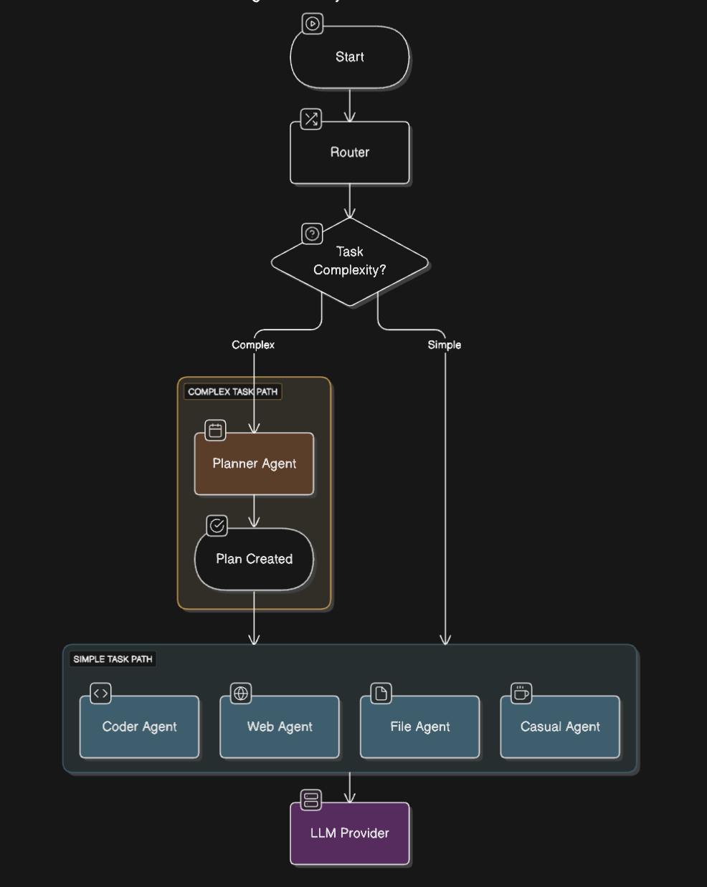
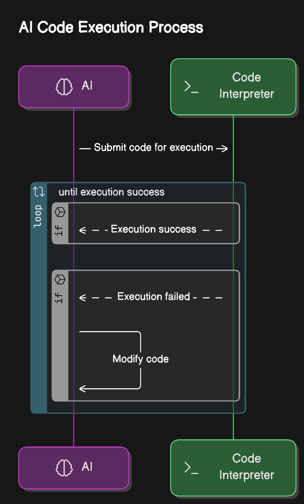

# Contributors guide

## Prerequisites

- Python 3.10 or higher.
- Docker or Orbstack or Podman.
- Ollama with some deepseek-r1 variant installed or similar local reasoning model.
- Basic familiarity with Python and AI models.
- Join the discord (optional): https://discord.gg/8hGDaME3TC

## Contribution Guidelines

We welcome contributions in the following areas:

- Code Improvements: Optimize existing code, fix bugs, or add new features.
- Documentation: Improve the README, write tutorials, or add inline comments.
- Testing: Write unit tests, integration tests, or help with debugging.
- New Features: Implement new tools, agents, or integrations.

## Steps to Contribute

Fork the project to your GitHub account.

Create a Branch:

```bash
git checkout -b feature/your-feature-name
```

Make Your Changes.

Write your code, add documentation, or fix bugs.

Test Your Changes.

Ensure your changes work as expected and do not break existing functionality.

Push your changes to your fork and submit a pull request to the main branch of this repository. Provide a clear description of your changes and reference any related issues.

## Good practice

1. **Privacy First, Always Local**
   - All core functionality must be able to run 100% locally
   - Cloud services should only be optional alternatives, clearly defined with a warning message.
   - remote APIs are only allowed for specific tools (weather api, MCP, flight search, etc...)
   - User data privacy is non-negotiable

2. **Agent-Based Architecture**
   - Each agent should have a clear, single responsibility
   - Agents should be modular and independently testable
   - New agents should solve specific use cases

3. **Tool-Based Extensibility**
   - Tools should be self-contained and follow the Tools base class
   - Each tool should do one thing well
   - Tools should provide clear feedback on success/failure

4. **User Experience**
   - Provide meaningful feedback for all operations
   - Support multiple languages
   - Text to speech with short response.
   - Keep responses concise

5. **Code Quality**
   - Write clear, self-documenting code
   - Include type hints and docstrings
   - Follow existing patterns in the codebase
   - Add a if __name__ == "__main__" at the bottom of each class file for individual testing.
   - Ideally had automated tests.

6. **Error Handling**
   - Fail gracefully with meaningful messages
   - Include recovery mechanisms where possible
   - Log errors appropriately without exposing sensitive data

## Areas Needing Help

Here are some tasks and areas where we need contributions:

- Web Browsing: Improve the autonomous web browsing capabilities for the assistant.
- Graphical interface, a web graphical interface. (please ask first)
- Multi-Agent System: Enhance the planner agent for divide and conqueer for task (please ask first).
- New Tools: Add support for additional programming languages or APIs.
- MCP: Add MCP protocol compatibility (possibly as a special type tool).
- Multi-language support: for Text to speech & speech to text
- Prompt engineering: improve prompts, compare results with different prompts for a identical query. Iterate until you find better prompt.
- Bug hunt: Hunt and fix bugs.
- Crossplatform: enhance cross-platform support.
- Testing: Write comprehensive tests for existing features.

# Implementing and using Tools

Tools are extensions that enable agents to perform specific actions, such as running Python code, making API calls, or conducting web searches. All tools inherit from the Tools base class, which provides methods for parsing and executing tool instructions.

## Tools parsing

Agents invoke tools using a standardized format called a block. A block consists of the tool name followed by the content (e.g., code, query, or parameters) to execute. The format looks like this:

BECAUSE WE USE MARKDOWN QUOTE FORMAT, READING WILL BE BROKEN ON GITHUB PLEASE START READING THE FILE AS RAW: https://raw.githubusercontent.com/Fosowl/agenticSeek/refs/heads/main/CONTRIBUTING.md


```<tool name>
<code or query to execute>
```

Or:

```web_search
What to do in Taipei?
```

we call these "blocks".

The Tools class provides the load_exec_block method to extract and parse blocks from an agent's response. This method identifies the tool name and content, enabling the system to execute the appropriate action.

How to handle multiple arguments then ?

Good question! Each tool is free to handle argument in it's own way within the block, but we provide a common parsing logic:

```flight_search
from=Paris
to=Taipei
date=30/04/2026
```

To extract these parameters, use the `get_parameter_value` method provided by the Tools class. Each tool can define its own parameter-handling logic, but the Tools class ensures consistent parsing.

Again if a tool need a specific format, you could implement a specific method for parsing a block. Using get_parameter_value is optional.

The content of blocks can also be saved using :path, for instance:

```python:toto.py
print("Hello world")
```

Will save the code in toto.py file within the work_folder defined in the config.ini

## Execution

When developing a tool, you must implement three abstract methods defined in the Tools class to handle execution, failure detection, and feedback to the agent. These methods ensure consistent behavior across tools and enable robust interaction with the LLM.

### 1. Execute method

```
@abstractmethod
def execute(self, blocks: [str], safety: bool) -> str:
```

This method defines how the tool processes the provided block(s) and produces a result.

### 2. execution_failure_check 

```
@abstractmethod
def execution_failure_check(self, output: str) -> bool:
```

This method analyzes the tool’s output to determine if the execution was successful or failed.

### 3. interpreter_feedback

```
@abstractmethod
def interpreter_feedback(self, output: str) -> str:
```

This method generates a feedback message for the LLM, helping it understand the tool’s execution outcome and adjust its behavior if needed.

Recap:
- load_exec_block: Extracts and parses tool blocks from the agent's response.
- get_parameter_value: Retrieves parameter values from a block's content.
- File handling: Supports saving block content to files when a :path is specified.

# Implementing and using Agents


Agents are classes that define how an LLM interacts with users and processes inputs. They can use tools (e.g., for executing code or querying APIs) and maintain a memory of the conversation to provide context-aware responses. All agents inherit from the base Agent class, which provides core functionality like memory management and LLM communication.

The simplest agent example is the casual agent:

```
class CasualAgent(Agent):
    def __init__(self, name, prompt_path, provider, verbose=False):
        """
        The casual agent is a special for casual talk to the user without specific tasks.
        """
        super().__init__(name, prompt_path, provider, verbose, None)
        self.tools = {
        } # No tools for the casual agent
        self.role = "en"
        self.type = "casual_agent"
    
    def process(self, prompt, speech_module) -> str:
        self.memory.push('user', prompt)
        animate_thinking("Thinking...", color="status")
        answer, reasoning = self.llm_request()
        self.last_answer = answer
        return answer, reasoning
```

Agent have several parameters that should be sets:

`tools`: A dictionary of tools the agent can use. Each tool must inherit from the Tools class. For example, a CasualAgent has no tools ({}), while a coding agent might include a Python execution tool.

`role`:A dictionary defining the agent's role, used by the routing system to select the appropriate agent.
`type: the agent type, a fixed name to identify the unique agent type.

Every agent must implement the process method, which defines how it handles user input and generates a response.

**Workflow:**

Push the user's prompt to the agent's memory using self.memory.push('user', prompt).
Call self.llm_request() to generate a response and reasoning based on the memory context.
Store and return the response and reasoning.

Note the memory logic. You only need to push the 'user' message. The llm_request method take care of pushing the assistant message. 

This separation of user and assistant memory handling may be inconsistent and could be refactored for clarity in the near future.

**Tool blocks execution**

Each agent might return block of tool to execute, as explained in the **Implementing and using Tools** section.

In a single text returned by an agent, a succession of block might be present for example, the coding agent answer could be:

I will create a work folder:

```bash
mkdir myAGI
```

I will enter the folder.

```bash
cd myAGI
```

I will create a python code.

```python:myAGI/super_smart.py
<python code>
```

The `execute_modules` method allow to automatically find, parse and execute all tools from a LLM prompt.

It will look in the agent answer for any tool "block" execute the appropriate tool and return a (success, feedback) tuple.

```
def execute_modules(self, answer: str) -> Tuple[bool, str]:
```

# Architecture Overview

## 1. Agent selection logic

<p align="center">

<p>

The agent selection is done in 4 steps:
1. determine query language and translate to english for the zero-shot model and llm_router.
2. Estimate the task complexity and best agent.
    - If HIGH complexity: return the planner agent. 
    - If LOW complexity: Determine the best agent for the task using a vote system between 2 classification models.
3. Process high complexity query.
    - If task was high complexity, planner agent will create a json plan to divide and conqueer the task with multiple agent.
4. Proceed with task(s)

## 2. Agents

### File/Code agents

<p align="center">

<p>

The File and Code agents operate similarly: when a prompt is submitted, they initiate a loop between the LLM and a code interpreter. This loop continues executing commands or code until the execution is successful or the maximum number of attempts is reached.

### Web agent

<p align="center">

<p>

The Web agent controls a Selenium-driven browser. Upon receiving a query, it begins by generating an optimized search prompt and executing the web_search tool. It then enters a navigation loop, during which it:

- Analyzes the content and interactive elements of the current page.
- Decides which link to follow, either from the current page or the web_search results.
- Determines if it should navigate back if so, it re-evaluates the original web_search results.
- Identifies and interacts with web forms, extracting or filling them as needed.
- Signals completion by requesting to exit once it considers the task fulfilled.

## Code of Conduct

See CODE_OF_CONDUCT.md

**Thank You!**
